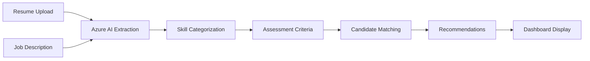

# VEO APP - AI-powered Sourcing Recruitment System

[](https://nextjs.org/)
[](https://fastapi.tiangolo.com/)
[](https://azure.microsoft.com/en-us/products/ai-services)
[](LICENSE)

> **An intelligent recruitment platform that leverages Azure AI to match candidates with job requirements through automated skill extraction and weighted assessment criteria.**

*This project was developed during a 2-month internship by a team of 3 developers, focusing on modernizing the recruitment process through AI-powered candidate screening and matching.*

## 🚀 Overview

VEO is a comprehensive talent matching platform that automates the candidate screening process by:
- **Extracting skills** from resumes and job descriptions using Azure AI
- **Creating weighted assessment criteria** (barem) for objective evaluation
- **Matching candidates** to jobs with intelligent scoring algorithms
- **Providing an intuitive dashboard** for recruiters to manage the entire process

## ✨ Key Features

### 🤖 AI-Powered Skill Extraction
- Automatic skill extraction from PDF resumes using Azure AI and CrewAI
- Job description parsing to identify required competencies
- Categorized skill classification (Technical, Business Intelligence, Programming, etc.)
- Support for multiple file formats and text input

### 📊 Smart Candidate Matching
- Multi-candidate analysis with customizable scoring thresholds
- Weighted assessment criteria (barem) for objective evaluation
- Synonym handling and fuzzy matching for accurate skill comparison
- Real-time recommendation engine

### 💼 Modern Recruitment Dashboard
- **Jobs Dashboard**: Manage job postings and requirements
- **Candidates Overview**: Browse all candidates with filtering and search
- **Job Detail View**: Deep dive into specific positions with candidate recommendations
- **Assessment Criteria**: Create and manage weighted scoring systems
- **PDF Viewer**: Built-in resume viewer with zoom and navigation controls
- **AI Reports**: Detailed analysis and scoring breakdowns

### 🗄️ Comprehensive Data Management
- SQLite database for candidate reports and job data
- Asset management for CV files organized by job categories
- Persistent storage of assessment criteria and recommendations
- Export capabilities for reports and candidate data

## 🏗️ Architecture

### Frontend (Next.js 15)
```
frontend/
├── app/                    # App Router pages and API routes
│   ├── candidates/        # Candidates overview page
│   ├── job/[id]/         # Job detail pages
│   └── api/              # Backend integration APIs
├── components/            # Reusable UI components (Shadcn/Radix)
├── hooks/                # Custom React hooks for data fetching
├── assets/jobs/          # CV files organized by job title
└── lib/                  # Utilities and API services
```

### Backend (FastAPI)
```
backend/src/resume/
├── main.py               # FastAPI application with all endpoints
├── crew.py               # CrewAI agents for document analysis
├── skill_extraction.py   # Azure AI integration for skill extraction
├── database.py           # SQLAlchemy models and database session
├── report_schema.py      # Pydantic schemas for structured data
└── tools/                # Custom tools for PDF processing
```

### Data Flow


## 🛠️ Technology Stack

| Layer | Technologies |
|-------|-------------|
| **Frontend** | Next.js 15, React 19, TypeScript, Tailwind CSS |
| **UI Components** | Radix UI, Shadcn/ui, Lucide React |
| **Backend** | FastAPI, Uvicorn, SQLAlchemy |
| **AI/ML** | Azure AI Inference, CrewAI, LiteLLM |
| **Database** | SQLite |
| **PDF Processing** | PyMuPDF, PyPDF2 |
| **Utilities** | SWR, python-dotenv, rapidfuzz |

## 📋 Prerequisites

- **Node.js** 20.17.0+ and npm
- **Python** 3.10-3.12 
- **uv** (Python package manager) - [Install here](https://github.com/astral-sh/uv)
- **Azure AI Services** account with API access

## ⚙️ Environment Setup

### Backend Configuration
Create a `.env` file in the `backend/` directory:

```env
# Azure AI Configuration
model=azure/your-model-deployment-name
AZURE_AI_API_KEY=your-azure-api-key
AZURE_AI_ENDPOINT=https://your-resource.openai.azure.com/
AZURE_AI_API_VERSION=2024-02-15-preview
```

### Frontend Configuration
No additional environment variables needed for basic setup.

## 🚀 Quick Start

### 1. Clone the Repository
```bash
git clone -b finale https://github.com/youssefbenlallahom/VEO-Next-Js.git
cd "VEO-Next-Js"
```

### 2. Start the Backend
```bash
# Navigate to backend directory
cd backend

# Install dependencies with uv
uv sync

# Start the FastAPI server
uv run uvicorn src.resume.main:app --host localhost --port 8000 --reload
```
The backend will be available at `http://localhost:8000`

### 3. Start the Frontend
```bash
# Navigate to frontend directory (in a new terminal)
cd frontend

# Install dependencies
npm install

# Start the development server
npm run dev
```
The frontend will be available at `http://localhost:3000`

### 4. Access the Application
- **Main Dashboard**: http://localhost:3000
- **API Documentation**: http://localhost:8000/docs
- **Interactive API**: http://localhost:8000/redoc

## 📖 Usage Guide

### Adding Job Requirements
1. Navigate to the Jobs Dashboard
2. Click "Add Job" or select an existing job
3. Upload job description or paste text
4. The system will automatically extract required skills

### Setting Assessment Criteria
1. Open a job details page
2. Configure skill weights in the Assessment Criteria panel
3. Set percentage weights for different skill categories
4. Save the barem for consistent evaluation

### Processing Candidates
1. Upload candidate resumes via the Candidates page
2. The system automatically extracts skills using AI
3. Candidates are matched against job requirements
4. View recommendations with detailed scoring

### Analyzing Results
1. Review AI-generated reports for each candidate
2. Compare candidates side-by-side
3. Access detailed skill breakdowns and matching rationale
4. Export results for further analysis

## 🔌 API Documentation

### Core Endpoints

#### Skill Extraction
```http
POST /extract-skills-from-cv
Content-Type: multipart/form-data

file: [PDF resume]
job_title: "Data Analyst"
```

#### Multi-Candidate Matching
```http
POST /analyze-skill-match-multi
Content-Type: application/json

{
  "job_title": "Data Analyst",
  "candidates": [
    {"name": "John Doe", "skills": {"Business Intelligence": ["Power BI", "Tableau"]}}
  ],
  "job_skills": {"Business Intelligence": ["Power BI", "SQL"]},
  "threshold": 70
}
```

#### Assessment Criteria Management
```http
POST /barem
Content-Type: application/json

{
  "job_title": "Data Analyst",
  "skills_weights": {"Business Intelligence": 30, "Programming": 25},
  "categorized_skills": {"Business Intelligence": ["Power BI"], "Programming": ["Python"]}
}
```

### Data Endpoints
- `GET /candidates` - List all candidates
- `GET /job-skills/{job_title}` - Get job requirements
- `GET /job-barem/{job_title}` - Get assessment criteria
- `GET /display-skills` - List all extracted candidate skills

## 🗃️ Database Schema

The SQLite database (`candidate_reports.db`) includes:

- **candidate_reports**: Stores AI analysis results and scores
- **extracted_skills**: Candidate skills extracted from resumes
- **job_required_skills**: Job requirements and assessment criteria

## 📁 Project Structure

```
veo-finale/
├── 📂 backend/
│   ├── 📄 pyproject.toml           # Python dependencies (uv)
│   ├── 📄 requirements.txt         # Alternative pip requirements
│   ├── 📄 .env                     # Environment configuration
│   └── 📂 src/resume/
│       ├── 📄 main.py              # FastAPI application
│       ├── 📄 crew.py              # AI agents and tasks
│       ├── 📄 skill_extraction.py  # Azure AI integration
│       ├── 📄 database.py          # SQLAlchemy models
│       └── 📂 config/              # Agent and task configurations
├── 📂 frontend/
│   ├── 📄 package.json             # Node.js dependencies
│   ├── 📄 next.config.ts           # Next.js configuration
│   ├── 📂 app/                     # App Router pages
│   ├── 📂 components/              # React components
│   ├── 📂 hooks/                   # Custom React hooks
│   ├── 📂 assets/jobs/             # CV files by job category
│   └── 📂 lib/                     # Utilities and services
├── 📄 candidate_reports.db         # SQLite database (auto-generated)
└── 📄 README.md                    # This file
```

## 🚦 Development Status

This project was completed as part of a 2-month internship program. Current status:

- ✅ **Core Features**: Fully implemented and tested
- ✅ **AI Integration**: Azure AI successfully integrated
- ✅ **Dashboard**: Complete recruitment workflow UI
- ✅ **API**: RESTful backend with comprehensive endpoints
- 🔄 **Testing**: Basic testing implemented, comprehensive test suite in progress
- 📋 **Documentation**: API documentation available at `/docs`

## 🤝 Contributing

This project was developed by a team of 3 interns:
- Frontend Development & UI/UX
- Backend Development & AI Integration  
- Database Design & API Architecture

For contributions or questions about the codebase, please refer to the commit history and inline documentation.

## 🔒 Security Considerations

- Environment variables for sensitive API keys
- CORS configuration for frontend-backend communication
- Input validation and sanitization for file uploads
- SQL injection prevention through SQLAlchemy ORM

## 📊 Performance Notes

- Uses uv for faster Python package management
- Next.js App Router for optimal frontend performance
- SQLite for lightweight, file-based data storage
- Turbopack for faster development builds

## 🎯 Future Enhancements

- [ ] Multi-language support for international recruitment
- [ ] Advanced analytics dashboard with charts and insights
- [ ] Integration with popular ATS (Applicant Tracking Systems)
- [ ] Machine learning model training on historical matching data
- [ ] Bulk candidate processing capabilities
- [ ] Email notification system for recruiters

## 📜 License

This project is licensed under the MIT License. See the [LICENSE](LICENSE) file for details.

## 🙏 Acknowledgments

- **Microsoft Azure AI** for providing the AI capabilities
- **CrewAI** framework for agent-based processing
- **Shadcn/ui** for beautiful, accessible components
- **FastAPI** team for the excellent Python web framework
- **Next.js** team for the React framework

---

*Built with ❤️ during a 2-month internship program focused on AI-powered recruitment solutions.*


## Tech Stack

- __Frontend__: Next.js 15, React 19, Radix UI, Shadcn components, Tailwind CSS v4, SWR, react-pdf
- __Backend__: FastAPI, Uvicorn, SQLAlchemy, SQLite
- __AI__: CrewAI LLM wrapper configured for Azure AI (model, endpoint, api_version)
- __PDF__: PyMuPDF/PyPDF2, Custom PDF tool
- __Utilities__: python-dotenv, rapidfuzz (similarity), python-multipart

See `backend/pyproject.toml` and `backend/requirements.txt`, and `frontend/package.json`.


## Project Structure

```
finale/
├─ backend/
│  ├─ src/resume/
│  │  ├─ main.py                # FastAPI endpoints
│  │  ├─ skill_extraction.py    # Azure AI skill extraction
│  │  ├─ report_schema.py       # Pydantic report schema
│  │  ├─ database.py            # SQLAlchemy + SQLite
│  │  ├─ crew.py                # CrewAI agents & tasks
│  │  └─ tools/                 # Custom tools (e.g., PDF)
│  ├─ requirements.txt
│  └─ pyproject.toml
├─ frontend/
│  ├─ app/                      # Next.js app router & API routes
│  ├─ components/               # UI components (Radix/Shadcn)
│  ├─ hooks/                    # Data hooks to backend/assets
│  ├─ assets/jobs/              # CVs organized by job
│  └─ package.json
└─ candidate_reports.db         # SQLite database (generated)
```


## Prerequisites

- Node.js 20+ and npm
- Python 3.10–3.12
- Azure AI Inference credentials
  - AZURE_AI_API_KEY
  - AZURE_AI_ENDPOINT
  - AZURE_AI_API_VERSION
  - model (deployment name)


## Local Installation

- __Backend__
  1. Create and activate a virtualenv (recommended).
  2. Copy `backend/.env.example` to `backend/.env` (or create `.env`) and set:
     - `AZURE_AI_API_KEY=...`
     - `AZURE_AI_ENDPOINT=...` (e.g., https://<resource>.openai.azure.com)
     - `AZURE_AI_API_VERSION=...` (e.g., 2024-02-15-preview)
     - `model=...` (deployment name)
  3. Install deps:
     ```bash
     pip install -r backend/requirements.txt
     ```
  4. Start API:
     ```bash
     uvicorn resume.main:app --host 0.0.0.0 --port 8000 --reload --app-dir backend/src
     ```

- __Frontend__
  1. Install deps:
     ```bash
     cd frontend
     npm install
     ```
  2. Start dev server:
     ```bash
     npm run dev
     ```
  3. The dashboard runs on http://localhost:3000

If your backend runs on a different port/host, configure the frontend API base URL in your data layer (`frontend/lib/api-service` if present) or environment.


## Usage

- Open http://localhost:3000
- Explore jobs and candidates in the dashboard.
- Backend endpoints listen on http://localhost:8000
- Use the provided API routes to:
  - Upload CVs or submit job descriptions for skill extraction
  - Generate/Update a barem for a job
  - Analyze multiple candidates for recommendations
  - Query stored reports/candidates


## API Documentation (selected)

Base URL: `http://localhost:8000`

- __POST__ `/extract-skills-from-cv`
  - Form-data inputs: either `file: PDF` or `job_description: string` + `job_title: string`
  - Response: categorized skills JSON or `{ "already_extracted": true }`

- __GET__ `/display_skills`
  - Returns all extracted candidate skills from SQLite.

- __GET__ `/job-skills/{job_title}`
  - Returns previously extracted required skills for a job.

- __GET__ `/job-barem/{job_title}`
  - Returns assessment criteria (barem) for a job.

- __POST__ `/barem`
  - Body:
    ```json
    {
      "job_title": "Data Analyst",
      "skills_weights": {"Business Intelligence": 20, "Programming Languages": 20},
      "categorized_skills": {"Business Intelligence": ["Power BI"], "Programming Languages": ["SQL"]}
    }
    ```
  - Persists/updates `barem_json` for the job.

- __POST__ `/analyze-skill-match-multi`
  - Body:
    ```json
    {
      "job_title": "Data Analyst",
      "candidates": [{"name": "Jane Doe", "skills": {"Programming Languages": ["SQL", "Python"]}}],
      "job_skills": {"Programming Languages": ["SQL", "Python"], "Business Intelligence": ["Power BI"]},
      "threshold": 50
    }
    ```
  - Response: `{ "matched_candidates": ["Jane Doe"], "errors": null }`

- __GET__ `/candidates`
  - Returns candidate names with report counts and latest report date.

- __GET__ `/candidate/{candidate_name}/reports`
  - Returns all saved reports for a candidate.

- __GET__ `/candidate/{candidate_name}/latest`
  - Returns latest report for a candidate.

Note: Additional endpoints exist under `backend/src/resume/main.py`.


## Database Schema (SQLite)

- __Table: candidate_reports__ (SQLAlchemy in `database.py`)
  - Fields: `applied_job_title`, `applied_job_description`, `candidate_name`, `candidate_job_title`,
    `candidate_experience`, `candidate_background`, `requirements_analysis (JSON)`, `match_results (JSON)`,
    `scoring_weights (JSON)`, `score_details (JSON)`, `total_weighted_score (Float)`, `strengths (JSON)`,
    `gaps (JSON)`, `rationale (Text)`, `risk (Text)`, `next_steps (JSON)`, `is_recommended (Boolean)`, `created_at`

- __Table: extracted_skills__ (created ad-hoc in `main.py`)
  - Fields: `candidate_name`, `cv_filename`, `skills_json`

- __Table: job_required_skills__ (created ad-hoc in `main.py`)
  - Fields: `job_title`, `required_skills_json`, `barem_json`, `analyzed_candidates?`, `recommended_candidates?`

The database file `candidate_reports.db` is created at the project root.


## Testing

- Backend: add pytest-based tests under `backend/tests/` (suggested). Example invocations:
  ```bash
  pytest -q
  ```
- Frontend: run `npm run test` after adding tests with Jest/RTL (suggested).


## Deployment

- __Docker (suggested)__
  - Build separate images for frontend and backend. Expose 3000 (FE) and 8000 (BE). Use a reverse proxy (nginx/Caddy).
- __Vercel + Render/Fly.io__
  - Frontend on Vercel. Backend on a Python host (Render/Fly/Azure App Service). Provide env vars for Azure AI and persist `candidate_reports.db` to a mounted volume.
- __Azure__
  - Backend as Azure App Service with managed identity/secrets. Frontend as Static Web Apps or Vercel. Use Azure Files for SQLite or migrate to a hosted DB.


## 🤝 Contributing

This project was developed collaboratively during a 2-month internship by a team of 3 developers:

- **Nour Jazi**
- **Doua Boudokhan**  
- **Youssef Ben Lallahom**

All team members worked together on every aspect of the project including frontend development, backend architecture, AI integration, database design, and UI/UX through collaborative coding sessions, pair programming, and shared problem-solving.
h

### For Future Contributors

1. Fork the repo and create a feature branch.
2. Run both apps locally and add/adjust tests.
3. Submit a PR with a clear description and screenshots for UI changes.

Use conventional commits and keep changes scoped.


## License

MIT License. See `LICENSE`.


## 📸 Platform Screenshots

### Candidates Overview Dashboard

*Browse all candidates with intelligent filtering, search functionality, and quick access to CVs. Shows candidate skills, locations, and application status at a glance.*

### Job Listings Dashboard  

*Comprehensive job management interface displaying all open positions with applicant counts, departments, and priority levels. Quick access to AI-powered analysis for each role.*

### Job Detail & Candidate Analysis

*Detailed job view showing applicants with AI matching scores, skill breakdowns, and recommendation status. Features filtering by favorites and AI-generated insights.*

### Assessment Criteria Configuration

*Interactive skill weighting system allowing recruiters to set custom evaluation criteria. Supports multiple skill categories with percentage-based weights for objective candidate scoring.*

### Job Skills Configuration Modal

*Advanced configuration interface for setting up job-specific assessment criteria with granular control over skill weights, experience levels, and language requirements.*

### Senior BI Developer Job Details

*Example job posting showing detailed requirements, responsibilities, and quick stats including applied candidates (2), recommended candidates (5), and favorites tracking.*

## Key Features Demonstrated

- ✨ **Modern UI/UX**: Clean, professional interface built with Shadcn/UI components
- 🎯 **Smart Matching**: AI-powered candidate recommendations with percentage scores
- 📊 **Flexible Assessment**: Customizable skill weighting and evaluation criteria  
- 🔍 **Advanced Filtering**: Search and filter candidates by skills, status, and preferences
- 📱 **Responsive Design**: Works seamlessly across desktop and mobile devices
- ⚡ **Real-time Updates**: Live candidate scoring and recommendation updates


## Acknowledgments

- CrewAI and the open-source community
- Radix UI/Shadcn
- Azure AI Inference
